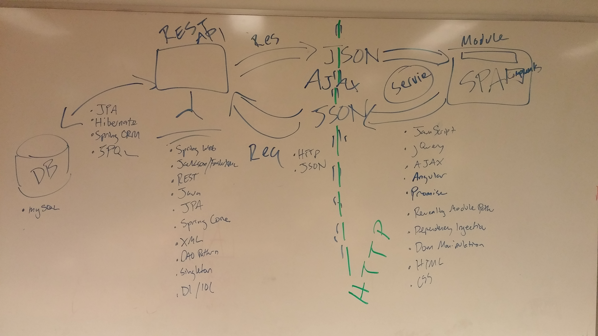

# Final Project (AutoAdvisor);
## Authors: Airik Leon, David Stumpe, David Chirdon, and Jason Caldwell
### January 2018

## Website home
;
### Summary of Technologies in Project

<!--  -->
### Version control
* Git/Github
### Data layer
* Database: MySQL
### Business layer
* Java
* Gradle
* ORM: JPA/Hibernate
* JDBC
* Spring REST
* Junit
* Spring security
* Jackson JSON serializer
### Presentation layer
* AngularJS
* JQuery
* HTML5
* CSS3
* Google API - geocoding
* Google API - Distance Matrix

## API ROUTES
### GET (USER)
http://airikleon.io:8080/AutoAdvisor/user/{userID}
http://airikleon.io:8080/AutoAdvisor/user/{userID}/vehicle
http://airikleon.io:8080/AutoAdvisor/user/{userID}/vehicle/{vid}
http://airikleon.io:8080/AutoAdvisor/user/{userID}/request
http://airikleon.io:8080/AutoAdvisor/user/{userID}/request/{vid}
http://airikleon.io:8080/AutoAdvisor/user/{userID}/business
http://airikleon.io:8080/AutoAdvisor/user/{userID}/business/{bid}

### POST(USER)
http://airikleon.io:8080/AutoAdvisor/user/
http://airikleon.io:8080/AutoAdvisor/user/{userId}/vehicle
http://airikleon.io:8080/AutoAdvisor/user/{userId}/request

### PUT(USER)
http://airikleon.io:8080/AutoAdvisor/user/{userID}
http://airikleon.io:8080/AutoAdvisor/user/{userID}/vehicle/{bid}
http://airikleon.io:8080/AutoAdvisor/user/{userID}/request/{rid}

### DELETE(USER)
http://airikleon.io:8080/AutoAdvisor/user/{userID}
http://airikleon.io:8080/AutoAdvisor/user/{userID}/vehicle/{bid}
http://airikleon.io:8080/AutoAdvisor/user/{userID}/request/{rid}

### GET(BUSINESS)
http://airikleon.io:8080/AutoAdvisor/business/{bid}
http://airikleon.io:8080/AutoAdvisor/business/{bid}/request
http://airikleon.io:8080/AutoAdvisor/business/{bid}/request/{rid}
http://airikleon.io:8080/AutoAdvisor/business/{bid}/quote/
http://airikleon.io:8080/AutoAdvisor/business/{bid}/quote/{qid}
http://airikleon.io:8080/AutoAdvisor/business/{bid}/request/{vid}
http://airikleon.io:8080/AutoAdvisor/business/{userID}/user

### POST(BUSINESS)
http://airikleon.io:8080/AutoAdvisor/business
http://airikleon.io:8080/AutoAdvisor/business/{bid}/quote

### PUT(BUSINESS)
http://airikleon.io:8080/AutoAdvisor/business/{bid}
http://airikleon.io:8080/AutoAdvisor/business/{bid}/quote/{qid}

### DELETE(BUSINESS)
http://airikleon.io:8080/AutoAdvisor/business/{bid}
http://airikleon.io:8080/AutoAdvisor/business/{bid}/quote/{qid}

### Database Schema

### UML Diagrams

### Licensing
See the file called LICENSE.

### About the developers
To see additional information and other projects visit our personal websites:
* [Airik Leon](http://airikleon.io/)
* [David Stumpe](http://18.216.47.133/)
* [David Chirdon](http://18.220.183.119/)
* [Jason Caldwell](http://jdcald13.com/)
