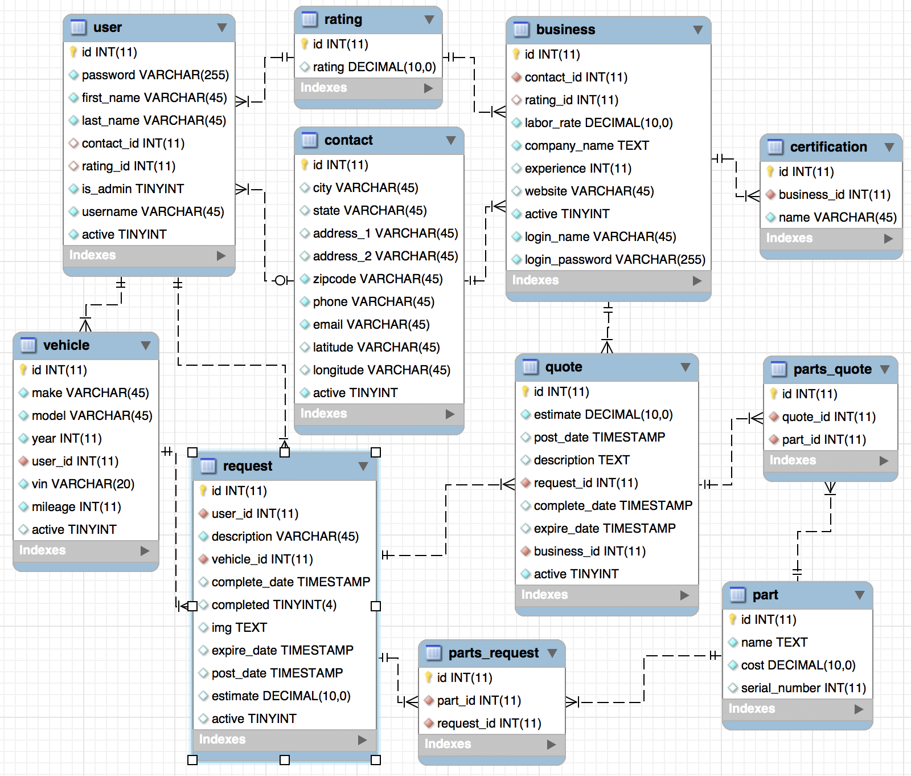

# Final Project
### Developed by Airik Leon, David Stumpe, David Chirdon, and Jason Caldwell

#### January 2018

## Program Overview
A week and a half sprint on a four person team...

### Summary of Technologies in Course

### Database

### UML Diagrams

### Licensing
See the file called LICENSE.

### About the developers
To see additional information and other projects visit our personal websites:
* [Airik Leon](http://airikleon.io/)
* [David Stumpe](http://18.216.47.133/)
* [David Chirdon](http://18.220.183.119/)
* [Jason Caldwell](http://jdcald13.com/)

