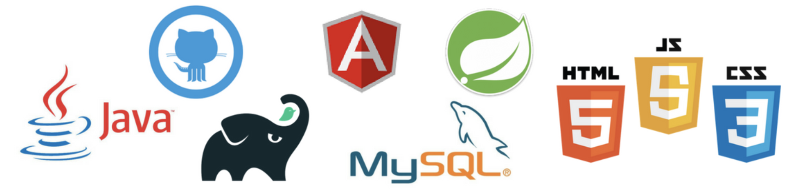
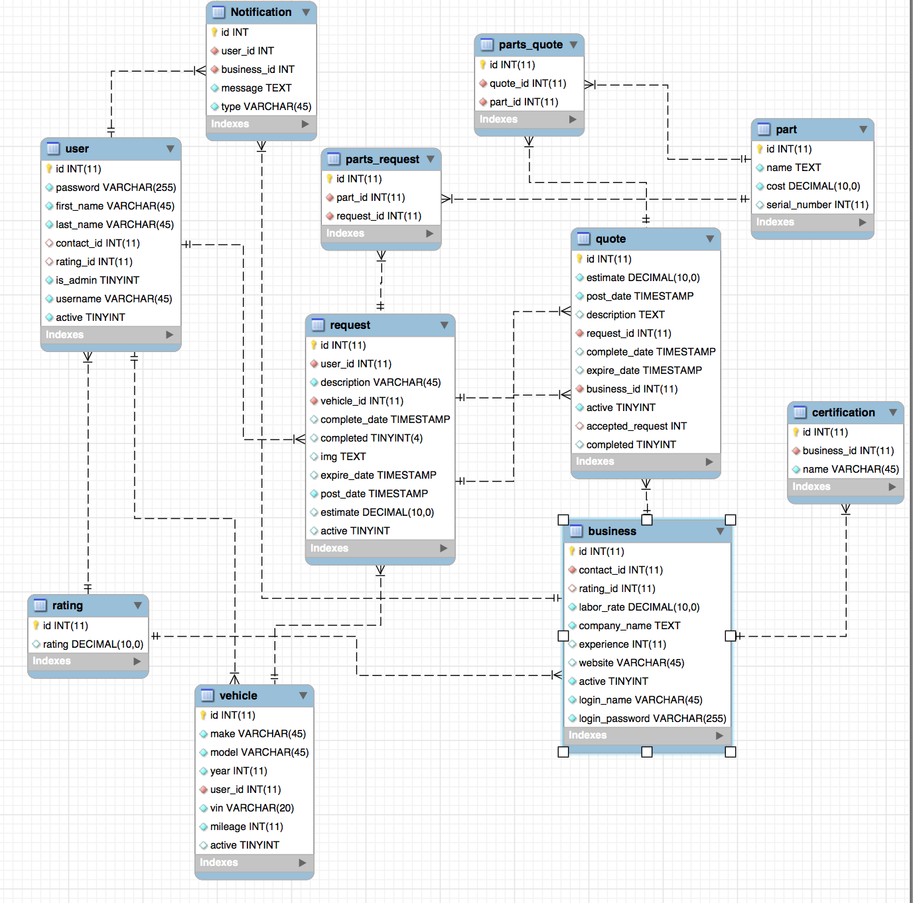
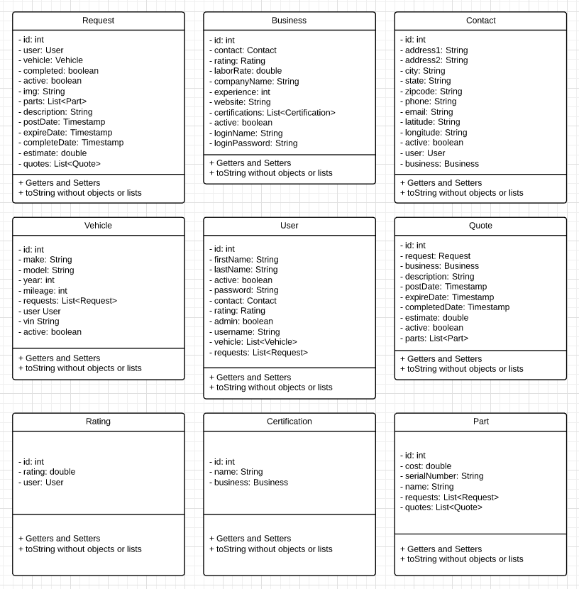

# Auto Advisor
## Authors: Airik Leon, David Stumpe, David Chirdon, and Jason Caldwell
### January 2018

*Note:* This project is no longer interactive because it is not being dynamically hosted or maintained anymore.

## Website home

### Summary of Technologies in Project

### Version control
* Git/Github
### Data layer
* Database: MySQL
### Business layer
* Java
* Gradle
* ORM: JPA/Hibernate
* JDBC
* Spring REST
* Junit
* Spring security
* Jackson JSON serializer
### Presentation layer
* AngularJS
* JQuery
* HTML5
* CSS3
* Google API - geocoding
* Google API - Distance Matrix

### API ROUTES
* GET (USER)
* POST(USER)
* PUT(USER)
* DELETE(USER)
* GET(BUSINESS)
* POST(BUSINESS)
* PUT(BUSINESS)
* DELETE(BUSINESS)

### Database Schema

### UML Diagrams

### Licensing
See the file called LICENSE.
